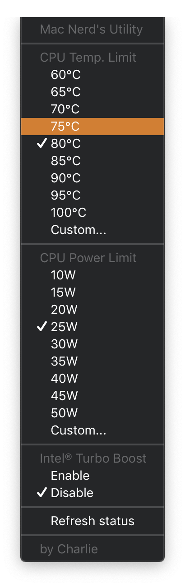

# my-hammerspoon-config
 ### My Hammerspoon config for Mac nerds.  

- Use this config with [smc_fan_util](https://github.com/charlie0129/smc_fan_util), [AnVMSR](https://www.insanelymac.com/forum/topic/341394-anvmsr-11-for-catalina-1015/) amd [smcutil](https://github.com/sicreative/BatteryStatusShow/blob/master/BatteryStatusShow/smcutil/Products/usr/local/bin/smcutil). (Maybe I will write a combined binary later) 
  
  - Make sure you have checked the limitations of each utility above (especially [smc_fan_util](https://github.com/charlie0129/smc_fan_util), since I haven't updated it and it is only compatible with 15-inch MBPs).
  - Remember to change the path variables at the beginning of [init.lua](https://github.com/charlie0129/my-hammerspoon-config/blob/master/init.lua) to the path of the above binaries.  
  
- Also, to ensure that the commands that require root privileges function properly, do <u>***any***</u> of the following:   
  - Include your user name and password in all the `hs.osascript.applescript` sections. 

    For example: 

    change 

    ```applescript
    hs.osascript.applescript(string.format('do shell script "%s"', cmd))
    ```
  
    to
  
    ```applescript
    hs.osascript.applescript(string.format('do shell script "%s" password "yourpassword" with administrator privileges, cmd))
    ```
  
  - Disable password prompts for `sudo` command.
  
    - Edit `/private/etc/sudoers` using this command: `sudo vim /private/etc/sudoers`
  
    - Find something like `root ALL = (ALL) NOPASSWD: NOPASSWD: ALL` and change the surrounding 3 lines to:
  
    ```shell
    # root and users in group wheel can run anything on any machine as any user
    root        ALL = (ALL) NOPASSWD: NOPASSWD: ALL
    %admin      ALL = (ALL) NOPASSWD: NOPASSWD: ALL
    ```
  
  
### This config allows quick actions:  
- Set Intel CPU temperature limit
- Set Intel CPU power limit
- Enable/disable Intel Turbo Boost
- Change various fan speed modes
- Change battery charging limits
- Change GPU switch modes

### Screenshots:
<a herf="https://github.com/charlie0129/my-hammerspoon-config/blob/master/img/cpu.png">
  
</a>
<a herf="https://github.com/charlie0129/my-hammerspoon-config/blob/master/img/other.png">
  
</a>
<!--


-->
